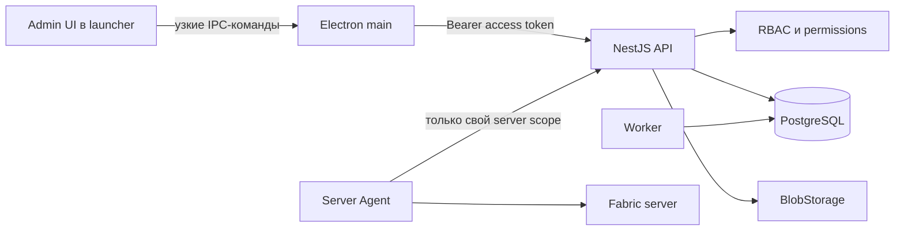

# План административной платформы Lapis

Статус: этап A завершён, client-only часть этапа B реализована локально. Дата: 21 августа 2026 года.

## Реализованный вертикальный срез

На 21 августа 2026 года выполнена основа этапа A и client-only часть этапа B:

- добавлены нормализованные роли, permissions, глобальные/server-scoped назначения и audit events;
- создана системная роль `super_admin`, получающая все текущие и будущие права;
- внедрены глобальный access-token guard, `@Public`, `@CurrentUser`, `@RequirePermissions` и permission guard;
- добавлены `/v1/me` и защищённый `GET /v1/admin/servers`;
- access token убран из Electron renderer и хранится только в памяти main process;
- добавлена CLI-команда bootstrap существующего пользователя;
- в launcher добавлен закрытый административный экран со списком серверов;
- добавлен dev-only browser bridge: renderer можно проверять на `http://localhost:5173` через локальный API без Windows UI automation; packaged Electron его не включает в рабочий путь;
- e2e проверяет `401`, `403`, выдачу `super_admin` и успешный admin-запрос;
- пользователь `extectick` назначен локальным dev `super_admin` для ручной проверки.

Этап B выполнен в ограниченном client-only объёме: администратор может добавить сервер из шаблона существующей клиентской сборки, изменить название, адрес, порт и видимость, загрузить клиентский JAR, включить или выключить его и удалить выбранные моды с подтверждением. Каждому новому серверу создаётся отдельная копия клиентской сборки, поэтому изменение мода не затрагивает другие серверы. Каждая мутация записывается в `audit_events`.

Загрузка JAR идёт multipart-потоком с лимитом 128 МБ во временный файл. Проверяются безопасное имя, расширение и ZIP/JAR-сигнатура. Новые файлы хранятся как неизменяемые SHA-1 blobs, а имя JAR остаётся именем мода внутри конкретной сборки: новое имя добавляет выключенный мод в начало списка, повторная загрузка того же имени заменяет версию только в выбранной сборке и сохраняет текущее состояние переключателя. API безопасно читает `fabric.mod.json` без распаковки архива и показывает совместимость с Minecraft/Fabric; если метаданных недостаточно, статус остаётся честным «Не определено». Для ранее загруженных файлов сохранено чтение legacy-пути по имени. Выключенные моды не входят в подписанный install-manifest. Перед запуском launcher строго синхронизирует JAR в каталоге `mods` выделенной instance с manifest: добавляет выбранные, обновляет изменившиеся и удаляет любые лишние JAR. Конфиги, сохранения, ресурспаки, шейдеры и остальные пользовательские файлы не затрагиваются.

Информация сервера и состав клиентских модов открываются отдельными явными действиями в строке сервера. В окне модов панель добавления, выбора и удаления закреплена сверху. Удаление является массовым, требует подтверждения и удаляет привязки только из выбранной сборки. Неизменяемый CAS blob пока сохраняется: он может использоваться другой сборкой и будет удаляться отдельной безопасной сборкой мусора после появления учёта ссылок.

## 1. Цель и принятые решения

Нужно добавить в LapisLauncher закрытый административный раздел, который позволяет:

- управлять каталогом игровых серверов;
- хранить каталог модов и их версий;
- собирать совместимые клиентскую и серверную части одной игровой сборки;
- безопасно публиковать, активировать и откатывать сборки;
- видеть, кто и когда изменил данные.

Первая административная роль — `super_admin`: она имеет все текущие и будущие права. При этом модель сразу строится как RBAC с отдельными разрешениями, чтобы позже без миграции архитектуры добавить редактора сборок, оператора сервера, модератора и права только на выбранные серверы.

Админ-раздел первой версии размещается внутри Electron-приложения. API и модель авторизации не зависят от Electron, поэтому отдельную web-панель можно будет добавить позже как ещё один клиент тех же endpoint'ов.

## 2. Почему текущую модель нельзя расширять напрямую

Сейчас `GameBuild` содержит изменяемый список только клиентских `BuildMod`, а `Server` ссылается прямо на активную сборку. Для конструктора этого недостаточно:

- нет серверной стороны мода;
- нет каталога модов и отдельных версий одного мода;
- нет черновика, проверки и безопасной публикации;
- изменение активной записи способно сразу сломать загрузку у всех клиентов;
- файлы привязаны к каталогу `client-mods`, а не к неизменяемому содержимому;
- нет истории, отката, аудита и защиты от одновременного редактирования.

Поэтому опубликованная сборка должна быть неизменяемой ревизией. Редактируется только черновик, а сервер переключается на новую ревизию одним атомарным действием после полной проверки.

## 3. Архитектура

Границы ответственности:

- renderer отображает данные и отправляет намерение пользователя, но не определяет права и не формирует произвольные пути или URL;
- Electron main хранит access token только в памяти, выбирает локальные файлы и потоково отправляет их в API;
- API проверяет пользователя, permission, входные данные и переходы состояний;
- PostgreSQL хранит метаданные, состояния и аудит;
- `BlobStorage` хранит неизменяемые файлы по SHA-256;
- отдельный Server Agent позже применяет серверную часть сборки рядом с конкретным Minecraft-сервером.

Redis на первом этапе не нужен. Текущей нагрузке достаточно PostgreSQL и существующего worker. Долгие операции хранятся как задания в БД; worker забирает их ограниченными пачками. Это уменьшает число сервисов и фоновые расходы.

## 4. Масштабируемая модель прав

### 4.1. Таблицы

#### `roles`

- `id uuid`;
- `key varchar unique` — например `super_admin`, `build_editor`;
- `name`;
- `is_super_admin boolean default false`;
- `is_system boolean default false`;
- `created_at`, `updated_at`.

#### `permissions`

- `id uuid`;
- `key varchar unique`;
- `description`;
- `created_at`.

Добавление нового permission не требует изменения структуры БД.

#### `role_permissions`

- `role_id`;
- `permission_id`;
- составной primary key.

#### `user_roles`

- `id uuid`;
- `user_id`;
- `role_id`;
- `scope_type enum(GLOBAL, SERVER)`;
- `scope_id nullable` — идентификатор сервера для scoped-роли;
- `assigned_by_user_id`;
- `created_at`, `expires_at nullable`.

Для `GLOBAL` значение `scope_id` обязано быть `NULL`, для `SERVER` — заполнено. Ограничение и уникальность задаются SQL-миграцией с partial indexes.

#### `audit_events`

- `id uuid`;
- `actor_user_id`;
- `action`;
- `resource_type`, `resource_id`;
- `server_id nullable`;
- `before jsonb nullable`, `after jsonb nullable`;
- `request_id`, `created_at`.

В аудит запрещено записывать пароли, JWT, refresh/game tickets, ключи подписи и содержимое секретов.

### 4.2. Начальные permissions

- `admin.access`;
- `servers.read`, `servers.write`;
- `mods.read`, `mods.write`, `mods.archive`;
- `builds.read`, `builds.write`, `builds.publish`, `builds.activate`;
- `deployments.read`, `deployments.execute`;
- `audit.read`;
- `roles.read`, `roles.manage`.

`super_admin.is_super_admin = true` означает полный доступ, включая permissions, добавленные в будущем. Обычные роли получают только явно назначенные permissions.

### 4.3. Проверка доступа

- глобальный `AccessTokenGuard` проверяет JWT и загружает пользователя;
- `@RequirePermissions(...)` задаёт требования endpoint'а;
- `PermissionsGuard` получает эффективные права пользователя из БД;
- scoped permission дополнительно сверяет `serverId` из маршрута с `user_roles.scope_id`;
- отсутствие права всегда возвращает `403`, независимо от того, скрыта ли кнопка в UI;
- `/v1/me` возвращает `roles`, `permissions`, `isSuperAdmin` и доступные server scopes для построения интерфейса;
- административные мутации повторно проверяют доступ внутри service-метода перед критической транзакцией.

При текущей нагрузке эффективные права безопаснее читать из PostgreSQL на каждом административном запросе. Оптимизация начинается с одного запроса с join'ами на request, без постоянного фонового опроса. Короткий cache можно добавить позже только вместе с `authorizationVersion` и гарантированной инвалидацией.

Первый `super_admin` назначается существующему Lapis-пользователю только локальной CLI-командой внутри API-контейнера. Публичного endpoint'а bootstrap не будет. Нельзя снять роль с последнего активного `super_admin`.

## 5. Модель модов, файлов и сборок

### 5.1. Неизменяемое хранилище

#### `artifacts`

- `id uuid`;
- `sha256 char(64) unique` — основной адрес и проверка целостности;
- `sha1 char(40)` — временная совместимость с клиентским manifest v1;
- `size bigint`;
- `storage_key`;
- `original_file_name`;
- `media_type`;
- `state enum(UPLOADING, READY, REJECTED, ORPHANED)`;
- `created_by_user_id`, `created_at`.

Файлы размещаются как `blobs/sha256/aa/bb/<full-sha256>`. Интерфейс `BlobStorage` получает две реализации:

1. `LocalBlobStorage` на отдельном volume — первая production-версия;
2. `S3BlobStorage` — последующая миграция на S3-совместимое хранилище/CDN без изменения business logic.

JAR загружается потоково с лимитом размера и числа файлов; целиком в RAM он не попадает. Во время одного pipeline считаются SHA-256/SHA-1 и размер, затем временный файл атомарно переименовывается в content-addressed путь. Повторная загрузка того же SHA-256 не создаёт копию.

### 5.2. Каталог модов

#### `mods`

- `id uuid`;
- `slug unique`;
- `display_name`;
- `description nullable`;
- `source_url nullable`;
- `archived_at nullable`;
- `created_at`, `updated_at`.

#### `mod_versions`

- `id uuid`;
- `mod_id`;
- `version`;
- `minecraft_version`;
- `loader enum(FABRIC)`;
- `detected_environment enum(CLIENT, SERVER, BOTH, UNKNOWN)`;
- `artifact_id`;
- `fabric_mod_id`;
- `metadata jsonb` — нормализованные данные `fabric.mod.json`;
- `created_by_user_id`, `created_at`;
- unique `(mod_id, version, minecraft_version, loader, artifact_id)`.

API безопасно открывает JAR как ZIP, проверяет лимиты количества/размера entries, запрещает traversal и читает только известные metadata-файлы. Имя, версия и dependencies показываются администратору до добавления в сборку. Определённая модом сторона является подсказкой; опасное ручное переопределение требует явного подтверждения и попадает в аудит.

### 5.3. Сборка и ревизии

#### `builds`

- логическая сборка: `id`, `slug`, `name`, `minecraft_version`, `loader`;
- сама запись не является устанавливаемой версией.

#### `build_revisions`

- `id uuid`;
- `build_id`;
- `version_label` — например `26.2-r3`;
- `sequence int`;
- `status enum(DRAFT, VALIDATING, PUBLISHED, RETIRED)`;
- `edit_version int` для optimistic concurrency;
- `loader_version`, `java_major`;
- `client_manifest_hash nullable`, `server_manifest_hash nullable`;
- `signing_key_id nullable`, `signature nullable`;
- `created_by_user_id`, `published_by_user_id nullable`;
- `created_at`, `published_at nullable`.

#### `build_entries`

- `id uuid`;
- `revision_id`;
- `mod_version_id`;
- `target enum(CLIENT, SERVER, BOTH)`;
- `path`;
- `required boolean`;
- `policy enum(MANAGED, SEED, PRESERVE)`;
- unique `(revision_id, path, target)`.

Одна ревизия содержит согласованные клиентскую и серверную стороны. Client manifest получает `CLIENT + BOTH`, server manifest — `SERVER + BOTH`. Поэтому невозможно случайно активировать клиентскую сборку от одной версии и серверную от другой.

Опубликованные ревизии нельзя редактировать или удалять. Для изменения создаётся новый draft на основе выбранной ревизии. Откат — это переключение активного указателя на уже опубликованную ревизию.

### 5.4. Серверы и развёртывание

Существующий `Server` сохраняется, но получает:

- `active_revision_id` — версия для launcher;
- `desired_revision_id` — версия, которую должен применить server agent;
- `observed_revision_id` — фактически запущенная версия;
- `archived_at`, `sort_order`;
- ссылку на immutable icon artifact вместо общего `server-icon.png`.

Для серверной установки добавляются `deployment_jobs` со статусами:

`QUEUED → VALIDATING → DOWNLOADING → WAITING_FOR_STOP → APPLYING → STARTING → HEALTH_CHECK → SUCCEEDED`.

Ошибки переводят job в `FAILED`; после неуспешного health-check agent возвращает предыдущую рабочую ревизию и фиксирует `ROLLED_BACK`.

Server Agent устанавливается рядом с Minecraft-сервером и имеет отдельный ключ только на один `serverId`. Он не получает пользовательский JWT, права администратора или signing private key. Agent применяет файлы через staging-каталог, backup manifest и atomic rename; остановка/запуск выполняются через настраиваемый adapter, а не захардкоженную команду.

## 6. Безопасный workflow конструктора

1. Администратор создаёт draft или копирует опубликованную ревизию.
2. Выбирает существующие версии модов либо загружает новый JAR.
3. API потоково сохраняет artifact, проверяет hash и metadata.
4. Конструктор раскладывает элементы в `Клиент`, `Сервер` или `Обе стороны`.
5. API проверяет дубликаты Fabric mod id, версии Minecraft/loader, обязательные dependencies, совпадения путей и наличие READY artifacts.
6. `Сохранить` использует `edit_version`; конфликт двух открытых редакторов возвращает `409`, не затирая изменения.
7. `Опубликовать` повторяет полную проверку и в транзакции с `Serializable` isolation создаёт неизменяемые manifests и статус `PUBLISHED`. Конфликт транзакции ограниченно повторяется.
8. `Активировать` — отдельное подтверждаемое действие. Сначала все blobs и подписи должны быть доступны, затем атомарно меняется `desired_revision_id`.
9. Server Agent применяет серверную часть и проходит health-check.
10. Только после успешного server deployment API переключает `active_revision_id`, чтобы клиенты не получили сборку раньше сервера.
11. Каждое действие записывается в audit log.

Так публикация не оставляет систему в состоянии, когда половина файлов уже новая, а активный manifest ещё старый.

## 7. API первой версии

### Профиль и права

- `GET /v1/me`;
- `GET /v1/admin/permissions`;
- `GET /v1/admin/roles`;
- управление ролями реализуется API сразу, но UI назначения ролей можно отложить после bootstrap super admin.

### Серверы

- `GET /v1/admin/servers`;
- `POST /v1/admin/servers`;
- `GET /v1/admin/servers/:id`;
- `PATCH /v1/admin/servers/:id`;
- `POST /v1/admin/servers/:id/archive`;
- `POST /v1/admin/servers/:id/activate-revision`;
- `GET /v1/admin/servers/:id/deployments`.

Hard delete сервера не используется: сервер архивируется, чтобы сохранить историю сборок и аудита.

### Моды и artifacts

- `GET /v1/admin/mods`;
- `POST /v1/admin/mods`;
- `PATCH /v1/admin/mods/:id`;
- `POST /v1/admin/mods/:id/archive`;
- `POST /v1/admin/mods/:id/versions` — потоковый multipart upload;
- `GET /v1/admin/mods/:id/versions`;
- `GET /v1/admin/artifacts/:id`.

### Сборки

- `GET /v1/admin/builds`;
- `POST /v1/admin/builds`;
- `POST /v1/admin/builds/:id/revisions`;
- `GET /v1/admin/build-revisions/:id`;
- `PATCH /v1/admin/build-revisions/:id`;
- `PUT /v1/admin/build-revisions/:id/entries`;
- `POST /v1/admin/build-revisions/:id/validate`;
- `POST /v1/admin/build-revisions/:id/publish`;
- `GET /v1/admin/build-revisions/:id/diff/:otherId`;
- `POST /v1/admin/servers/:serverId/rollback/:revisionId`.

Все request/response схемы находятся в `@lapis/contracts` и валидируются Zod на обеих границах.

## 8. Интерфейс администратора

Админ-раздел появляется только при `admin.access` или `isSuperAdmin`. При открытии capability проверяется заново; `403` закрывает раздел и обновляет `/v1/me`, но не сбрасывает обычную пользовательскую сессию.

До включения административных мутаций текущий access token нужно убрать из renderer: refresh token продолжает храниться через `safeStorage`, access token живёт только в памяти Electron main, а renderer получает лишь профиль и capabilities. Все обычные и административные запросы выполняются через типизированные узкие IPC-методы. Это уменьшает последствия XSS и не позволяет UI самостоятельно обращаться к произвольным API endpoint'ам.

Разделы:

1. **Серверы** — список, online/maintenance, адрес, активная/фактическая ревизия, создание и редактирование.
2. **Сборки** — draft/published версии, конструктор из трёх зон `Клиент`, `Сервер`, `Обе стороны`, validate/diff/publish/activate/rollback.
3. **Моды** — каталог, версии, обнаруженные metadata/dependencies, загрузка нового JAR.
4. **Развёртывания** — текущий этап server deployment, ошибка, повтор и rollback.
5. **Аудит** — кто, что, когда и для какого сервера изменил.

Новый UI нужно вынести из текущего большого `app.tsx` в feature-модули. Для навигации внутри фиксированного Electron-окна достаточно собственного typed route state; обязательная зависимость от browser routing не нужна.

Выбор файла выполняет Electron main через системный dialog. Renderer не передаёт произвольный путь API. Прогресс upload/validation идёт отдельными IPC events с ограничением частоты обновлений, чтобы интерфейс не перерисовывался на каждый сетевой chunk.

## 9. Этапы реализации и точки ручной проверки

### Этап A. Auth foundation

- миграции `roles`, `permissions`, `role_permissions`, `user_roles`, `audit_events`;
- global access guard, `@Public`, `@CurrentUser`, `@RequirePermissions`;
- перенос access token из renderer в память Electron main и общий механизм прозрачного refresh;
- `/v1/me`;
- CLI назначения первого `super_admin` существующему нику;
- e2e: `401`, `403`, super admin, обычный пользователь, scope другого сервера, запрет снять последнего super admin.

**Ручная проверка:** обычный пользователь не видит админ-раздел и получает `403`; назначенный пользователь видит пустую страницу администратора и после перезапуска сохраняет доступ.

### Этап B. Server administration

- admin CRUD без hard delete;
- server icon как artifact;
- maintenance/visibility;
- аудит и Zod-контракты;
- UI списка и формы сервера.

**Ручная проверка:** создать тестовый скрытый сервер, изменить его, включить maintenance, увидеть записи аудита; публичный launcher видит только разрешённые серверы.

#### Реализованный client-only срез этапа B

- `POST /v1/admin/servers` создаёт сервер и изолированную копию активной клиентской сборки;
- `PATCH /v1/admin/servers/:id` изменяет название, адрес, порт и видимость;
- строка сервера разделена на понятные зоны «Информация» и «Моды», открывающие независимые адаптивные окна;
- `GET/POST /v1/admin/servers/:id/client-mods` читает и загружает клиентские JAR;
- `PATCH /v1/admin/servers/:id/client-mods/:modId` включает или выключает мод;
- `DELETE /v1/admin/servers/:id/client-mods` удаляет выбранные привязки модов после подтверждения в UI;
- новый JAR всегда добавляется выключенным и первым в списке; замена сохраняет состояние существующего мода;
- совместимость определяется локально по ограниченному чтению `fabric.mod.json`, без сетевых запросов и фонового опроса;
- повторная загрузка JAR с тем же именем обновляет SHA-1 выбранной сборки, не изменяя сборки других серверов;
- public catalog и подписанный manifest учитывают только включённые моды;
- API e2e проверяет hidden → visible, multipart upload, выключенное состояние по умолчанию, совместимость, toggle, manifest, удаление и audit;
- minecraft-core unit-тест проверяет удаление выключенного управляемого JAR без удаления неизвестного пользовательского файла.

**Ручной тест:** открыть «Управление», нажать «Добавить сервер», оставить видимость выключенной и сохранить. Убедиться, что сервер есть только в admin-списке. Открыть отдельно «Информацию», включить видимость и проверить основной список. Открыть «Моды», добавить корректный Fabric `.jar`: он должен появиться сверху выключенным и с результатом проверки совместимости. Включить его, затем загрузить изменённый JAR с тем же именем и убедиться, что состояние сохранено, а SHA-1 в manifest изменился без создания второй строки. Выбрать мод, нажать «Удалить», отменить подтверждение и убедиться, что список не изменился; повторить с подтверждением и проверить исчезновение мода из manifest и локальной сборки после следующей синхронизации.

### Этап C. Artifact и каталог модов

- `BlobStorage`, Local CAS, streaming multipart upload;
- hash/dedup/limits/JAR metadata validation;
- модели `Mod`, `ModVersion`, `Artifact`;
- UI каталога и загрузки с прогрессом.

**Ручная проверка:** загрузить client-only, server-only и common Fabric mods; повторный файл не занимает место дважды; повреждённый/слишком большой JAR отклоняется понятной ошибкой.

### Этап D. Конструктор и публикация

- `Build`, `BuildRevision`, `BuildEntry`;
- draft, copy, autosave, conflict detection, validate, diff;
- отдельные подписанные client/server manifests;
- publish/activate/rollback и миграция текущей `main` сборки.

**Ручная проверка:** собрать новую ревизию, увидеть найденные зависимости и конфликт; исправить, опубликовать, убедиться, что опубликованная версия не редактируется; откатиться на предыдущую.

### Этап E. Server Agent

- scoped credentials и enrollment;
- deployment jobs;
- staging, backup, stop/start adapters, health-check, rollback;
- desired/observed revision UI.

**Ручная проверка:** обновить тестовый сервер, намеренно сломать health-check и убедиться в автоматическом возврате старой серверной сборки без потери мира и пользовательских данных.

### Этап F. Production hardening

- backup/restore DB и blob volume;
- очистка только неиспользуемых orphan blobs после retention period;
- rate limits на admin login/upload/mutations;
- security headers, ограниченный CORS, request IDs;
- integration tests публикации и конкурентного редактирования;
- метрики размера storage, очереди jobs и неуспешных deployment;
- документация ключей, rollback и disaster recovery.

## 10. Что не делать

- не хранить одну колонку `role = admin` в `users`;
- не доверять скрытой кнопке как проверке прав;
- не редактировать опубликованную или активную сборку на месте;
- не копировать файлы под исходными именами без content hash;
- не загружать JAR как base64/JSON и не держать его целиком в памяти;
- не активировать client manifest до успешного применения серверной части;
- не давать Server Agent права администратора;
- не удалять мир, конфиги или неизвестные файлы сервера при смене ревизии;
- не добавлять Redis/Kafka/Kubernetes до появления подтверждённой нагрузки, для которой PostgreSQL worker и один API перестанут быть достаточны.

## 11. Первый реализуемый вертикальный срез

Начинать нужно с этапа A, затем сразу сделать read-only часть этапа B. После этого владелец сможет вручную проверить права и увидеть реальные серверы в закрытом разделе. Только после подтверждения этого среза стоит добавлять загрузку файлов и конструктор, потому что ошибки RBAC или модели сервера дешевле исправить до появления опубликованных artifacts.
