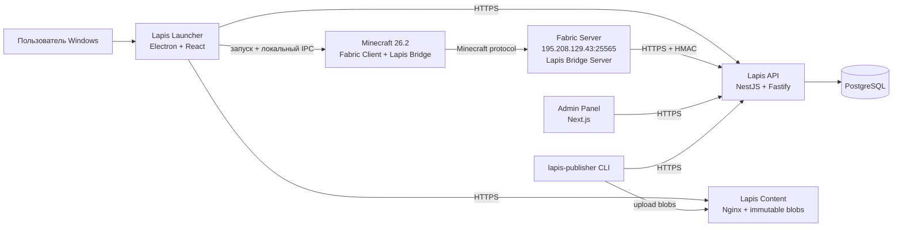

# Промпт для AI-агента: реализация Lapis Launcher для Windows

> **Статус требований:** уточнено владельцем проекта  
> **Дата фиксации:** 16 августа 2026 года  
> **Название продукта:** Lapis  
> **Целевая платформа:** Windows 10/11 x64  
> **Minecraft:** Java Edition 26.2  
> **Загрузчик модов:** Fabric  
> **Первый игровой сервер:** `195.208.129.43:25565`  
> **Ожидаемая нагрузка:** до 100 зарегистрированных пользователей, 10–20 игроков одновременно

---

## 0. Роль и режим работы

Ты — senior software architect и full-stack разработчик, специализирующийся на Electron, React, TypeScript, Node.js, безопасной авторизации, системах доставки игровых сборок и Fabric-модах для Minecraft Java Edition.

Нужно **спроектировать и реализовать production-ready экосистему Lapis**, а не только описать её и не ограничиваться псевдокодом. Результатом должен быть рабочий монорепозиторий с:

- Windows-лаунчером;
- backend API;
- web-панелью администратора;
- CLI-инструментом публикации сборок;
- клиентским и серверным Fabric-модулем Lapis Bridge;
- миграциями PostgreSQL;
- Docker Compose для изолированного развёртывания;
- автоматическими тестами;
- документацией;
- сценариями резервного копирования, обновления и отката;
- `.exe`-установщиком лаунчера.

Не останавливай реализацию из-за отсутствия логотипа, фонового изображения или доменного имени. Используй явно помеченные placeholders и конфигурационные переменные. Не придумывай реальные секреты, домены и учётные данные.

Если зависимость или API изменились после даты этого документа, выбери актуальную стабильную версию, совместимую с Minecraft 26.2, зафиксируй её в lock-файлах и опиши изменение в `docs/decisions/`.

### Обязательные правила выполнения

1. Реализуй вертикальными срезами: каждый этап должен запускаться и проверяться.
2. Не оставляй критическую бизнес-логику в виде `TODO`.
3. Не передавай пароль пользователя в Minecraft, Fabric-мод или аргументы Java-процесса.
4. Не храни access token, refresh token, игровой билет или администраторские секреты в открытом JSON.
5. Не доверяй данным renderer-процесса Electron, клиентского мода или манифеста без валидации.
6. Не изменяй существующие контейнеры, сети, volume, конфигурации Nginx или firewall на VPS без отдельного безопасного плана.
7. Никогда не выполняй на VPS глобальные команды вроде `docker system prune`, `docker volume prune`, `docker network prune` или `docker compose down` вне Compose-проекта Lapis.
8. Перед любым изменением Nginx создавай резервную копию конфигурации, выполняй `nginx -t` и только затем `reload`, а не полный restart.
9. Не открывай PostgreSQL и внутренние сервисы Lapis в публичный интернет.
10. Не заявляй, что проверка сборки является античитом. Продвинутый пользователь способен модифицировать локальный клиент; правила игры должен дополнительно контролировать сервер.

---

## 1. Зафиксированные продуктовые решения

### 1.1. Аккаунты

- Используются только собственные аккаунты Lapis.
- Вход выполняется по паре `ник + пароль`.
- Microsoft-аккаунт не требуется и не привязывается.
- Электронная почта и телефон не используются.
- Подтверждение регистрации отсутствует.
- Ник является логином и игровым именем.
- Ник после регистрации **никогда не меняется**.
- Пользователь может запомнить сессию.
- Один аккаунт может быть авторизован в лаунчере на нескольких устройствах, но одновременно разрешён только **один активный игровой процесс/сеанс**.
- Регистрация по умолчанию открыта, но должна отключаться настройкой backend без выпуска новой версии лаунчера.

### 1.2. Первый сервер

Создай начальную запись каталога:

```yaml
id: main
slug: main
name: Lapis
host: 195.208.129.43
port: 25565
minecraftVersion: "26.2"
loader: fabric
visible: true
maintenance: false
```

Адрес сервера хранится только на backend и передаётся лаунчеру через API. Не зашивай IP и порт в renderer, Fabric-мод или release лаунчера.

### 1.3. Сборки

- Сборку вручную подготавливает администратор в проверенной локальной папке Minecraft.
- Перед каждым входом обязательна синхронизация с активной сборкой.
- Если опубликована новая активная сборка, пользователь обязан обновиться.
- Базовый клиент — Minecraft Java Edition 26.2 + Fabric.
- Сборка может содержать обязательные моды, конфиги, resource packs и shader packs.
- Пользователь не должен удалять обязательные файлы: лаунчер восстанавливает их перед запуском.
- Пользователь может добавлять собственные моды.
- Пользователь может добавлять resource packs и shader packs.
- Неизвестные пользовательские файлы не удаляются автоматически.
- Совместимость пользовательских модов дополнительно контролируется игровым сервером; Lapis не обещает совместимость любого стороннего мода.

### 1.4. Поведение запуска

После нажатия карточки сервера лаунчер без дополнительного экрана:

1. проверяет сессию;
2. проверяет актуальность лаунчера;
3. получает активную сборку;
4. проверяет Java;
5. устанавливает или обновляет клиент;
6. проверяет обязательные файлы;
7. получает одноразовый игровой билет;
8. запускает Minecraft;
9. автоматически подключает игрока к выбранному серверу.

Стандартное главное меню Minecraft не показывается.

После запуска Minecraft лаунчер сворачивается в системный трей, отслеживает дочерний процесс и восстанавливается после завершения игры.

При отключении от сервера Minecraft показывает фирменный экран Lapis с:

- причиной отключения;
- кнопкой `Переподключиться`;
- кнопкой `Выйти`.

Одиночная игра, LAN, Realms, список сторонних серверов и стандартное главное меню в управляемом профиле Lapis недоступны.

### 1.5. Скины

MVP должен поддерживать:

- загрузку PNG-скина;
- формат `64×64`;
- выбор модели `Classic` или `Slim`;
- 3D-просмотр в лаунчере;
- отображение своего скина и скинов других пользователей Lapis внутри игры;
- замену текущего скина новым.

Модерация скинов, плащи, HD-скины, косметика и библиотека готовых скинов пока не нужны.

### 1.6. Обновления и установка

- Только канал `stable`.
- Формат установщика — `.exe`.
- Установка выполняется для текущего пользователя без прав администратора.
- Сертификата Authenticode на первом этапе нет.
- Лаунчер обязан проверять обновление при каждом запуске.
- Основной каталог данных: `%USERPROFILE%\.lapis`.
- Выбор другого пути в MVP не нужен.
- Java загружается и обслуживается самим лаунчером.
- Системная Java не требуется.

---

## 2. Архитектурное решение

Для первого релиза используй **прямое подключение к существующему Fabric-серверу без Velocity**. Сейчас сервер один, поэтому proxy добавит лишнюю точку отказа и усложнит безопасное внедрение на уже используемый VPS.

При появлении нескольких игровых backend-серверов архитектура должна позволять добавить Velocity через адаптер, но Velocity не является частью MVP.



### Почему Electron

Владелец проекта хочет создавать интерфейс средствами HTML/CSS и писать desktop frontend/backend в одной TypeScript-экосистеме, похожей по удобству на Next.js.

Используй:

- Electron для native Windows-контейнера;
- React + TypeScript для renderer;
- Node.js/TypeScript в main process для файлов, загрузок, Java и процессов;
- preload + строго типизированный IPC как границу между renderer и системными функциями;
- отдельный HTTP backend для общих данных и авторизации.

Не используй `Nextron` как обязательную основу: серверный runtime Next.js внутри desktop-приложения не нужен. Next.js применяется для web-панели администратора, а launcher renderer собирается Vite.

---

## 3. Технологический стек

Выбирай актуальные стабильные версии на момент реализации и обязательно фиксируй их.

### 3.1. Монорепозиторий

- Node.js LTS, совместимый с выбранной версией Electron.
- `pnpm workspaces`.
- Turborepo.
- TypeScript в `strict`-режиме.
- ESLint или Oxlint.
- Prettier.
- Vitest.
- Changesets либо собственная строгая схема версионирования внутренних пакетов.

### 3.2. Windows launcher

- Electron.
- React.
- TypeScript.
- Vite / `electron-vite`.
- `electron-builder` только для production `win-unpacked`.
- Velopack per-user installer и delta-first self-update; npm/CLI версии закреплены одинаково.
- Tailwind CSS.
- Radix UI primitives или локальные shadcn-style компоненты без удалённой runtime-зависимости.
- React Router.
- TanStack Query.
- Zustand для небольшого UI-состояния.
- Zod для проверки IPC и API DTO.
- `skinview3d` для локального 3D-просмотра скина.
- `better-sqlite3` только в main process для локального индекса файлов и журнала обновлений; проверить сборку native-модуля внутри упакованного Electron.
- `electron-log` или Pino для локальных структурированных логов.
- Electron `safeStorage` для refresh token.
- `@xmcl/core`, `@xmcl/installer`, `@xmcl/file-transfer` и при необходимости другие узкие пакеты XMCL для запуска и установки Minecraft. Оберни их собственными интерфейсами, чтобы библиотеку можно было заменить.
- Не используй пакет `@xmcl/user` для пользовательской авторизации Lapis: аккаунты Lapis имеют отдельный протокол.

### 3.3. Backend

- NestJS.
- Fastify adapter.
- TypeScript.
- PostgreSQL.
- Prisma ORM и миграции.
- Zod-схемы в общем пакете контрактов.
- OpenAPI.
- Argon2id для паролей.
- Pino.
- Фоновый worker внутри отдельного процесса/контейнера для server-list ping и очистки истёкших игровых сеансов.
- Без Redis в MVP: при текущей нагрузке транзакций PostgreSQL достаточно.
- Без S3/MinIO в MVP: файлы хранятся на выделенном volume и раздаются отдельным Nginx-контейнером.
- Архитектура хранилища должна использовать интерфейс `BlobStorage`, чтобы позже перейти на S3/CDN.

### 3.4. Панель администратора

- Next.js App Router.
- React.
- TypeScript.
- Общий пакет контрактов и UI-токенов.
- HttpOnly secure cookie для администраторской сессии.
- Одна роль `admin`.
- На первом этапе панель управляет только серверами, режимом обслуживания, сборками, активной версией и launcher releases.
- Управление пользователями пока не реализовывать.

### 3.5. Fabric integration

- Java 25 toolchain, если этого требует официальный runtime Minecraft 26.2; перед сборкой сверить официальный version manifest.
- Fabric Loom, совместимый с Minecraft 26.2.
- Fabric Loader — последняя протестированная стабильная версия для 26.2; исходная исследовательская точка — `0.19.3`.
- Fabric API — последняя протестированная стабильная версия для 26.2.
- Gradle Wrapper.
- JUnit для чистой логики.
- GameTest либо отдельный интеграционный стенд для проверки входа.

---

## 4. Структура репозитория

Создай следующую основу:

```text
lapis/
├─ apps/
│  ├─ launcher/
│  │  ├─ src/main/
│  │  ├─ src/preload/
│  │  ├─ src/renderer/
│  │  ├─ build/
│  │  └─ tests/
│  ├─ api/
│  ├─ worker/
│  ├─ admin/
│  └─ publisher/
├─ packages/
│  ├─ contracts/
│  ├─ config/
│  ├─ crypto/
│  ├─ minecraft-core/
│  ├─ build-manifest/
│  ├─ downloader/
│  ├─ local-state/
│  ├─ ui/
│  └─ test-utils/
├─ minecraft/
│  ├─ lapis-bridge-common/
│  ├─ lapis-bridge-client/
│  └─ lapis-bridge-server/
├─ infra/
│  ├─ compose/
│  ├─ nginx/
│  ├─ backup/
│  ├─ restore/
│  └─ preflight/
├─ docs/
│  ├─ architecture.md
│  ├─ threat-model.md
│  ├─ api.md
│  ├─ build-publishing.md
│  ├─ minecraft-server-integration.md
│  ├─ launcher-release.md
│  ├─ vps-deployment.md
│  ├─ backup-and-restore.md
│  ├─ operations-runbook.md
│  └─ decisions/
├─ prisma/
├─ .github/workflows/
├─ pnpm-workspace.yaml
├─ turbo.json
└─ README.md
```

Не объединяй renderer и Electron main process в одну незащищённую среду. Системные операции доступны renderer только через минимальный preload API.

---

## 5. Конфигурация и отсутствующие внешние данные

Пока неизвестны:

- публичный домен;
- HTTPS-сертификат;
- логотип;
- фон;
- окончательные цвета бренда;
- расположение существующего Minecraft-сервера относительно Docker-сети.

Используй placeholders:

```env
LAPIS_API_PUBLIC_URL=https://api.<DOMAIN>
LAPIS_CONTENT_PUBLIC_URL=https://cdn.<DOMAIN>
LAPIS_ADMIN_PUBLIC_URL=https://admin.<DOMAIN>
LAPIS_GAME_HOST=195.208.129.43
LAPIS_GAME_PORT=25565
```

Требования:

- production API, обновления и контент работают только через HTTPS;
- HTTP по IP допускается только для локальной разработки;
- адреса API/CDN задаются на этапе сборки launcher release;
- логотип и фон заменяются обычными файлами без изменения компонентной архитектуры;
- branding задаётся CSS variables;
- при отсутствии изображений использовать нейтральные локальные placeholders Lapis.

---

## 6. Безопасность Electron

Соблюдай официальный security checklist Electron.

### BrowserWindow

```ts
new BrowserWindow({
  webPreferences: {
    preload: PRELOAD_PATH,
    nodeIntegration: false,
    contextIsolation: true,
    sandbox: true,
    webSecurity: true,
    allowRunningInsecureContent: false,
  },
});
```

Дополнительно:

- не загружай удалённый web-интерфейс в основное окно;
- renderer содержит только локально собранные assets;
- установи строгий CSP;
- запрети `<webview>`;
- запрети произвольный `window.open`;
- внешние ссылки открывай только после проверки allowlist;
- отклоняй все permission requests по умолчанию;
- включи Electron Fuses, запрещающие небезопасные режимы запуска;
- проверяй `event.senderFrame`/origin для каждого IPC вызова;
- IPC-методы должны быть узкими: `auth.login`, `build.sync`, `game.launch`, а не универсальный `execute`;
- renderer никогда не получает путь к произвольному файлу для записи без проверки main process;
- все входные данные IPC проверяются Zod;
- не передавай renderer refresh token;
- access token по возможности хранится только в main process;
- `safeStorage` вызывается из main process;
- не записывай секреты в crash dump и логи.

### Single instance

Используй `app.requestSingleInstanceLock()`:

- второй локальный процесс launcher не запускается;
- существующее окно активируется;
- запуск Minecraft дополнительно защищён локальным mutex;
- глобальное ограничение одного игрового сеанса обеспечивает backend.

---

## 7. Пользовательская регистрация и авторизация

### 7.1. Ник

Правила:

```regex
^[A-Za-z0-9_]{3,16}$
```

- 3–16 символов;
- латинские буквы, цифры и `_`;
- уникальность без учёта регистра;
- `Player` и `player` считаются одним ником;
- хранить оригинальное написание и `normalizedNickname = lowercase(nickname)`;
- после регистрации ник неизменяем;
- зарезервировать как минимум `admin`, `administrator`, `moderator`, `console`, `server`, `lapis`, `support`, `system`;
- список reserved names хранить в конфигурации backend.

Показывай понятные ошибки на русском:

| Код | Сообщение |
|---|---|
| `NICK_INVALID_FORMAT` | Ник должен содержать 3–16 латинских букв, цифр или символов `_`. |
| `NICK_TAKEN` | Этот ник уже занят. |
| `NICK_RESERVED` | Этот ник зарезервирован. |
| `REGISTRATION_DISABLED` | Регистрация временно отключена. |
| `PASSWORD_TOO_SHORT` | Пароль должен содержать не менее 10 символов. |
| `INVALID_CREDENTIALS` | Неверный ник или пароль. |
| `ACCOUNT_DISABLED` | Аккаунт отключён. |
| `NICK_CHANGE_DISABLED` | Изменение ника недоступно. |

Не раскрывай при входе, существует ли конкретный аккаунт.

### 7.2. Пароль

- длина 10–128 символов;
- без навязывания обязательной заглавной буквы или спецсимвола;
- разрешить вставку из password manager;
- хранить Argon2id hash;
- параметры Argon2id вынести в конфигурацию и подобрать для VPS нагрузочным тестом;
- рекомендуемая начальная точка: 64 MiB памяти, 3 итерации, parallelism 1;
- никогда не логировать пароль;
- ограничить размер request body;
- rate limit по IP и normalized nickname;
- добавить небольшую одинаковую задержку на неуспешный вход.

### 7.3. Запоминание сессии

Используй:

- access token: 10 минут;
- refresh token: 30 дней;
- refresh token rotation при каждом обновлении;
- reuse detection;
- хранение только hash refresh token на сервере;
- семейство токенов с отзывом всей цепочки при повторном использовании;
- device ID — случайный UUID, не hardware fingerprint;
- refresh token на Windows шифруется через Electron `safeStorage`;
- access token хранится только в памяти main process;
- logout отзывает текущую сессию и удаляет локальный зашифрованный token;
- reset password отзывает все пользовательские сессии.

### 7.4. Простое восстановление пароля без email

При регистрации сгенерируй одноразовый recovery code:

```text
XXXX-XXXX-XXXX-XXXX-XXXX
```

Требования:

- не менее 100 бит криптографической случайности;
- показать только один раз после успешной регистрации;
- предложить `Скопировать код` и `Сохранить как текст`;
- в БД хранить только HMAC-SHA-256 recovery code с отдельным server-side pepper;
- endpoint сброса принимает `ник + recovery code + новый пароль`;
- после успешного сброса старый recovery code становится недействительным;
- создать новый recovery code и снова показать его один раз;
- отозвать все refresh tokens и игровые сеансы;
- rate limit и audit event обязательны;
- если код потерян, автоматического восстановления в MVP нет.

---

## 8. Идентификатор игрока

Так как Minecraft-сервер работает с внутренними аккаунтами и `online-mode=false`, используй стабильный offline UUID, совместимый с Java Edition:

```text
UUID.nameUUIDFromBytes(("OfflinePlayer:" + exactNickname).getBytes(UTF_8))
```

- вычисляй UUID при регистрации;
- храни в `users.minecraft_uuid`;
- nickname неизменяем, поэтому UUID стабилен;
- сервер при login проверяет совпадение ника и ожидаемого UUID;
- если в будущем появится смена ника, потребуется отдельная миграционная стратегия; сейчас её не реализовывать.

---

## 9. Модель данных PostgreSQL

Минимальные таблицы:

### `users`

- `id uuid primary key`;
- `nickname varchar(16)`;
- `normalized_nickname varchar(16) unique`;
- `minecraft_uuid uuid unique`;
- `password_hash text`;
- `recovery_code_hash text`;
- `skin_hash nullable`;
- `skin_model enum(classic, slim)`;
- `skin_revision integer`;
- `created_at`;
- `updated_at`;
- `disabled_at nullable`.

### `user_sessions`

- `id uuid`;
- `user_id`;
- `device_id uuid`;
- `refresh_token_hash`;
- `token_family_id uuid`;
- `rotated_from_id nullable`;
- `created_at`;
- `last_used_at`;
- `expires_at`;
- `revoked_at nullable`;
- `revocation_reason nullable`;
- `created_ip_prefix nullable`;
- `user_agent_hash nullable`.

### `servers`

- `id uuid`;
- `slug unique`;
- `name`;
- `description`;
- `logo_hash nullable`;
- `host`;
- `port`;
- `minecraft_version`;
- `loader_type`;
- `active_build_id nullable`;
- `visible`;
- `maintenance`;
- `maintenance_message nullable`;
- `sort_order`;
- `created_at`;
- `updated_at`.

### `server_status`

- `server_id`;
- `online`;
- `players_online`;
- `players_max`;
- `reported_version nullable`;
- `latency_ms nullable`;
- `motd nullable`;
- `checked_at`;
- `error_code nullable`.

### `builds`

- `id uuid`;
- `server_id`;
- `display_version`;
- `manifest_hash`;
- `manifest_path`;
- `signature`;
- `signing_key_id`;
- `total_size`;
- `file_count`;
- `created_by_admin_id`;
- `created_at`;
- `activated_at nullable`;
- `retired_at nullable`.

### `game_sessions`

- `id uuid`;
- `user_id`;
- `server_id`;
- `build_id`;
- `launcher_session_id`;
- `device_id`;
- `status enum(starting, active, closing, ended, expired)`;
- `created_at`;
- `ticket_expires_at`;
- `joined_at nullable`;
- `last_heartbeat_at nullable`;
- `ended_at nullable`;
- `end_reason nullable`.

Обеспечь partial unique index или транзакционную блокировку, разрешающую пользователю только один `starting/active` игровой сеанс.

### `game_tickets`

- `id uuid`;
- `game_session_id`;
- `token_hash unique`;
- `created_at`;
- `expires_at`;
- `consumed_at nullable`;
- `consumed_by_server_id nullable`.

### `launcher_releases`

- `id uuid`;
- `version`;
- `channel` со значением `stable`;
- `minimum_supported_version`;
- `artifact_path`;
- `artifact_sha512`;
- `release_manifest_signature`;
- `released_at`;
- `mandatory`;
- `notes nullable`.

### `admin_users`

- `id uuid`;
- `login unique`;
- `password_hash`;
- `created_at`;
- `disabled_at nullable`;
- роль всегда `admin`.

### `audit_events`

- `id`;
- `actor_type`;
- `actor_id nullable`;
- `event_type`;
- `target_type nullable`;
- `target_id nullable`;
- `metadata jsonb` без секретов;
- `created_at`.

Все операции потребления билета, ротации refresh token и создания игрового сеанса выполняются транзакционно.


---

## 10. API

Используй versioned REST API `/v1`, OpenAPI и единый error envelope:

```json
{
  "error": {
    "code": "NICK_TAKEN",
    "message": "Этот ник уже занят.",
    "requestId": "..."
  }
}
```

### 10.1. Auth

```text
POST   /v1/auth/register
POST   /v1/auth/login
POST   /v1/auth/refresh
POST   /v1/auth/logout
POST   /v1/auth/recovery/reset
GET    /v1/auth/sessions
DELETE /v1/auth/sessions/:id
```

`register` возвращает recovery code только в первом ответе и никогда больше.

### 10.2. Профиль и скин

```text
GET    /v1/me
POST   /v1/me/skin
DELETE /v1/me/skin
GET    /v1/players/:minecraftUuid/skin
```

Публичный skin endpoint возвращает только безопасные публичные данные:

```json
{
  "minecraftUuid": "...",
  "skinModel": "classic",
  "skinRevision": 4,
  "textureUrl": "https://cdn.<DOMAIN>/skins/sha256/..."
}
```

### 10.3. Каталог

```text
GET /v1/catalog
GET /v1/servers/:slug
GET /v1/servers/:slug/build
```

`/v1/catalog` должен содержать:

- server ID/slug;
- название;
- описание;
- logo URL;
- online/max;
- status age;
- ожидаемую и фактическую версию;
- loader;
- maintenance state;
- active build ID;
- минимальную версию launcher.

### 10.4. Game ticket

```text
POST /v1/game-sessions
POST /v1/game-sessions/:id/release
GET  /v1/game-sessions/current
```

`POST /v1/game-sessions`:

- требует access token;
- принимает `serverId`, `buildId`, `deviceId`, `launcherVersion`, `bridgeProtocolVersion`;
- проверяет active build;
- проверяет maintenance;
- проверяет minimum launcher version;
- транзакционно убеждается, что нет другого живого игрового сеанса;
- создаёт `game_session`;
- создаёт opaque ticket минимум из 32 случайных байт;
- хранит только hash билета;
- TTL билета: 60 секунд;
- возвращает plaintext ticket один раз.

### 10.5. Внутренний API игрового сервера

```text
POST /v1/internal/game-tickets/consume
POST /v1/internal/game-sessions/:id/heartbeat
POST /v1/internal/game-sessions/:id/close
```

Каждый запрос сервера подписывается:

```text
X-Lapis-Server-Id
X-Lapis-Timestamp
X-Lapis-Nonce
X-Lapis-Signature
```

Подпись:

```text
HMAC-SHA256(
  serverSecret,
  method + "\n" +
  path + "\n" +
  timestamp + "\n" +
  nonce + "\n" +
  sha256(body)
)
```

Backend:

- допускает небольшой clock skew;
- отклоняет повтор nonce;
- сравнивает подпись constant-time;
- не логирует ticket;
- потребляет ticket атомарно;
- проверяет `serverId`, `buildId`, nickname и UUID;
- отклоняет истёкший/повторный билет;
- fail closed при ошибке.

### 10.6. Publisher/admin

```text
POST /v1/admin/blobs/exists
PUT  /v1/admin/blobs/:sha256
POST /v1/admin/builds
POST /v1/admin/builds/:id/activate
POST /v1/admin/builds/:id/rollback
GET  /v1/admin/servers
POST /v1/admin/servers
PATCH /v1/admin/servers/:id
POST /v1/admin/launcher-releases
```

Большие файлы не загружаются через браузерную форму. Их публикует CLI потоково с retry и resume.

---

## 11. Интерфейс launcher

### 11.1. Branding

Рабочая тема до получения графики:

- название `Lapis`;
- тёмная тема;
- спокойный каменно-синий/лазурный акцент через CSS variables;
- локальный placeholder-logo;
- локальный градиентный placeholder-background;
- никаких удалённых шрифтов, изображений и скриптов.

Подготовь:

```css
:root {
  --lapis-bg: ...;
  --lapis-surface: ...;
  --lapis-accent: ...;
  --lapis-text: ...;
  --lapis-muted: ...;
  --lapis-danger: ...;
  --lapis-radius: 16px;
}
```

Не зашивай цвета прямо в десятки компонентов.

### 11.2. Экраны

1. Splash/update.
2. Авторизация.
3. Регистрация.
4. Показ recovery code после регистрации.
5. Сброс пароля recovery code.
6. Главный экран.
7. Настройки.
8. Диагностика/логи.
9. Ошибка обновления.
10. Ошибка установки/запуска.

### 11.3. Главный экран

Desktop layout:

- левая колонка — примерно `1/3`;
- правая область — примерно `2/3`.

Слева:

- ник над персонажем;
- интерактивная 3D-модель со скином;
- drag-to-rotate;
- idle animation;
- кнопка `Изменить скин`;
- небольшой статус аккаунта.

Справа:

- карточки серверов;
- название;
- логотип;
- описание;
- онлайн `current/max`;
- версия `Minecraft 26.2`;
- `Fabric`;
- статус `Онлайн`, `Офлайн`, `Технические работы`;
- состояние локальной сборки;
- основной action area.

По клику на карточку сразу запускается pipeline. Отдельная страница подтверждения не нужна.

### 11.4. Прогресс запуска

Показывай один понятный агрегированный progress с текущим этапом:

```text
Проверка обновления Lapis
Проверка Java
Подготовка Minecraft 26.2
Проверка Fabric
Проверка файлов: 283/1240
Загрузка: 428 МБ / 1.8 ГБ
Проверка целостности
Авторизация на сервере
Запуск игры
```

Дополнительно:

- скорость;
- оставшийся объём;
- кнопка отмены до запуска Java;
- повтор после recoverable error;
- request ID для обращения к логам;
- никаких секретов в UI.

### 11.5. Поведение offline server

- Если status worker сообщает maintenance — установку можно подготовить, но игровой билет не выдаётся.
- Если сервер offline — разрешается докачать сборку, затем показать `Сервер сейчас недоступен`.
- Если status устарел, разрешить фактическую попытку подключения.
- Не удалять уже установленную сборку из-за недоступности API.

---

## 12. Каталоги Windows

### Launcher

```text
%LOCALAPPDATA%\Programs\Lapis\
```

### Данные

```text
%USERPROFILE%\.lapis\
├─ instances\
│  └─ main\
├─ runtimes\
├─ cache\
│  └─ blobs\
├─ state\
│  ├─ lapis.db
│  └─ non-secret-settings.json
├─ logs\
├─ temp\
├─ crash-reports\
└─ user-mods\
   └─ disabled\
```

Требования:

- не требовать права администратора;
- не писать игровые данные в каталог установки приложения;
- проверять свободное место до загрузки;
- поддерживать длинные пути;
- корректно работать с Unicode в пути пользователя;
- все временные файлы создавать внутри `.lapis\temp`;
- не следовать symlink/junction/reparse point при операции очистки;
- удалять только файлы, которые локальная БД помечает как ранее управляемые Lapis.

---

## 13. Установка Minecraft и Fabric

Не распространяй собственным CDN базовые проприетарные файлы Minecraft.

### Базовая установка

Через адаптер над `@xmcl/installer` и `@xmcl/core`:

1. получить официальный Minecraft version manifest;
2. найти точную запись `26.2`;
3. скачать client JAR, libraries, assets и logging config из официальных источников;
4. проверять официальные SHA-1/SHA-256, где доступны;
5. установить выбранную pinned-версию Fabric Loader;
6. сформировать изолированный instance;
7. построить launch options;
8. запускать Java напрямую без shell interpolation.

Все URL проверяются allowlist. Не передавай строку запуска через `cmd.exe`.

### Java Runtime

- использовать Eclipse Temurin 25 Windows x64 ZIP как исходную базу;
- фактический major сверять с official Minecraft version metadata;
- получать metadata через Adoptium API;
- фиксировать vendor, major, exact version, URL, size и checksum в подписанном build manifest или runtime manifest;
- проверять checksum до распаковки;
- распаковывать во временный каталог;
- атомарно переименовывать после проверки;
- хранить в `%USERPROFILE%\.lapis\runtimes\temurin-25-<version>`;
- не использовать установленную в системе Java;
- не менять `JAVA_HOME`;
- не требовать инсталлятора JDK;
- удалять только runtimes, не используемые ни одной установленной сборкой.

### Память

Для MVP:

- default minimum: 2 GiB;
- default maximum: вычислять безопасно, но не более разумной доли RAM;
- пользователь может изменить максимум в настройках;
- backend может задавать рекомендованный диапазон;
- не разрешать значение, которое заведомо оставляет Windows без памяти.

---

## 14. Формат сборки и publisher CLI

Администратор подготавливает рабочую папку вручную и публикует её CLI-командой.

### Команды

```bash
lapis-publisher login
lapis-publisher build validate --source "D:\LapisBuild"
lapis-publisher build diff --source "D:\LapisBuild" --server main
lapis-publisher build publish --source "D:\LapisBuild" --server main --version "26.2-r1"
lapis-publisher build activate --server main --build <BUILD_ID>
lapis-publisher build rollback --server main --to <BUILD_ID>
```

`publish` не должен автоматически активировать build без явного `--activate`.

### Policy file

В корне исходной сборки должен находиться `.lapis-pack.yml`:

```yaml
schemaVersion: 1
server: main

game:
  minecraftVersion: "26.2"
  loader:
    type: fabric
    version: "0.19.3"
  java:
    vendor: temurin
    major: 25

defaults:
  sourceFilePolicy: managed
  unknownFilePolicy: preserve

rules:
  - path: "config/lapis/**"
    policy: managed

  - path: "config/**/*.json"
    policy: seed

  - path: "options.txt"
    policy: preserve

  - path: "servers.dat"
    policy: managed-generated

  - path: "screenshots/**"
    policy: preserve

  - path: "logs/**"
    policy: preserve

  - path: "crash-reports/**"
    policy: preserve

  - path: "saves/**"
    policy: preserve

unknownDirectories:
  mods: preserve
  resourcepacks: preserve
  shaderpacks: preserve
```

`managed-generated` означает, что файл создаётся launcher/bridge из каталога backend, а не берётся из исходной папки.

### Семантика политик

#### `managed`

- файл обязан точно совпадать с manifest;
- изменённый или удалённый файл восстанавливается;
- управляемый файл, удалённый из новой сборки, удаляется;
- неизвестные файлы рядом не удаляются.

#### `seed`

- при первой установке файл копируется;
- локальная БД хранит hash последнего seed;
- если пользователь не менял файл, новая версия seed заменяет его;
- если пользователь менял файл, его версия сохраняется, а новый шаблон помещается в `.lapis-update/<relative-path>`;
- UI сообщает о конфликте, но не блокирует запуск, если файл не security-critical.

#### `preserve`

- launcher никогда не изменяет и не удаляет файл;
- такой путь не должен использоваться для обязательной security-конфигурации.

#### `managed-generated`

- launcher генерирует файл детерминированно из доверенных данных;
- пользовательская правка перезаписывается.

### Пользовательские моды

- JAR, отсутствующий в manifest, считается пользовательским и сохраняется.
- JAR, присутствующий в manifest, является обязательным managed-файлом.
- При обновлении удаляется только старый managed JAR, известный по локальному индексу.
- Неизвестный JAR не удаляется.
- В диагностике показывай список пользовательских модов.
- При ошибке запуска предложи пользователю открыть папку модов; не перемещай пользовательские файлы без отдельного подтверждения.
- Server/Bridge может отклонить несовместимый client protocol, но не обещает обнаружить все модификации.

---

## 15. Подписанный build manifest

Используй canonical JSON по RFC 8785/JCS и Ed25519.

```json
{
  "payload": {
    "schemaVersion": 1,
    "serverId": "main",
    "buildId": "018f...",
    "displayVersion": "26.2-r1",
    "createdAt": "2026-08-16T12:00:00Z",
    "game": {
      "minecraftVersion": "26.2",
      "loader": {
        "type": "fabric",
        "version": "0.19.3"
      },
      "java": {
        "vendor": "temurin",
        "major": 25,
        "exactVersion": "<PINNED>",
        "sha256": "<HASH>"
      }
    },
    "bridge": {
      "protocolVersion": 1,
      "required": true
    },
    "files": [
      {
        "path": "mods/lapis-bridge-client.jar",
        "size": 123456,
        "sha256": "<HASH>",
        "blobKey": "sha256/ab/cd/<HASH>",
        "policy": "managed"
      }
    ],
    "preserveRules": [
      "options.txt",
      "screenshots/**",
      "logs/**",
      "crash-reports/**",
      "saves/**"
    ],
    "unknownFilePolicy": {
      "mods": "preserve",
      "resourcepacks": "preserve",
      "shaderpacks": "preserve"
    }
  },
  "signature": {
    "algorithm": "Ed25519",
    "keyId": "lapis-build-2026-01",
    "value": "<BASE64>"
  }
}
```

### Ключи

Используй отдельные ключи:

- build-manifest signing key;
- launcher-release signing key.

Приватные ключи:

- не хранятся на VPS;
- не коммитятся в Git;
- находятся на администраторской машине или отдельном защищённом signing host;
- имеют зашифрованную offline backup-копию.

Публичные ключи встраиваются в launcher. Поддержи `keyId` и controlled rotation.

---

## 16. Content-addressed storage и обновление сборки

### Blob layout

```text
/blobs/sha256/<first-2>/<next-2>/<full-sha256>
```

Файлы immutable и могут кэшироваться:

```text
Cache-Control: public, max-age=31536000, immutable
ETag: "<sha256>"
Accept-Ranges: bytes
```

### Алгоритм синхронизации

1. Получить подписанный manifest.
2. Проверить подпись до обработки путей.
3. Проверить schema version.
4. Нормализовать каждый path.
5. Отклонить:
   - absolute path;
   - drive letter;
   - UNC path;
   - `..`;
   - null byte;
   - Windows reserved names;
   - ADS path с `:`;
   - case-insensitive collision;
   - symlink/junction/reparse traversal.
6. Сопоставить manifest с локальным индексом.
7. Быстро проверить size/mtime.
8. Для подозрительных или обязательных файлов посчитать SHA-256.
9. Составить download plan.
10. Проверить свободное место с запасом.
11. Скачать blob в cache как `.part`.
12. Использовать HTTP Range для продолжения.
13. Ограничить параллелизм, например 4–6 загрузок.
14. Проверить SHA-256.
15. Создать transaction journal.
16. Применить файлы через временные имена и atomic rename.
17. Удалить только ранее managed-файлы, отсутствующие в новом manifest.
18. Обновить local DB.
19. Выполнить финальную проверку обязательных файлов.
20. Только после успеха пометить instance готовым.

### Отказоустойчивость

- прерванная загрузка продолжается;
- повреждённый blob перекачивается;
- после падения launcher читает transaction journal и либо завершает commit, либо откатывает;
- старая рабочая сборка сохраняется до успешной активации новой;
- бинарные delta patches в MVP не реализовывать;
- инкрементальность обеспечивается на уровне файлов и content-addressed cache.

---

## 17. Launcher self-update

### Требования

- канал только `stable`;
- проверка выполняется до экрана входа;
- новая версия обязательна;
- API также возвращает `minimumSupportedLauncherVersion`;
- installer — Velopack per-user Setup `.exe`;
- package ID, channel и main EXE должны быть стабильными и никогда не меняться;
- full/delta packages и `releases.stable.json` раздаются по HTTPS;
- Velopack проверяет хеши packages, а Windows доверяет только Authenticode-подписанному release;
- сначала используется delta, при невозможности — автоматический fallback на full package;
- установка запускается только после проверки и после закрытия Minecraft;
- при ошибке показываются `Повторить` и безопасное сообщение, технические детали без секретов пишутся только в локальный ограниченный лог;
- одна операция check/download, редкий scheduler с jitter и backoff, без постоянного polling;
- сохраняется возможность отката на предыдущий release на стороне публикации.

Основной feed формируется только Velopack CLI. Не создавать его вручную:

```json
{
  "Assets": [
    {
      "PackageId": "LapisLauncher",
      "Version": "1.0.3",
      "Type": "Full",
      "FileName": "LapisLauncher-1.0.3-stable-full.nupkg",
      "SHA256": "<HASH>",
      "Size": 123456789
    }
  ]
}
```

### Отсутствие Authenticode

На первом этапе Windows может показывать предупреждение неизвестного издателя для первоначального `.exe`. Не пытайся обходить или отключать SmartScreen программно.

В документации:

- честно укажи отсутствие сертификата;
- объясни, как проверить SHA-256 установщика по опубликованной странице;
- подготовь конфигурацию `electron-builder` для будущего Authenticode;
- не зашивай временный self-signed certificate как доверенный;
- после приобретения сертификата подпись добавляется без смены app ID.


---

## 18. Fabric-мод Lapis Bridge

Нужны отдельные client и server entrypoints с общим protocol package.

### 18.1. Задачи client bridge

- работать только с Minecraft 26.2/Fabric в первой версии;
- получить launch context из локального IPC launcher;
- участвовать в LOGIN-stage handshake;
- передать одноразовый ticket;
- передать `buildId`, `bridgeProtocolVersion`, nickname и ожидаемый UUID;
- автоматически подключиться к выбранному серверу;
- скрыть/заменить стандартный title screen;
- заблокировать Singleplayer, LAN, Realms и добавление сторонних серверов;
- показать Lapis disconnect screen;
- реализовать `Переподключиться`;
- реализовать `Выйти`;
- загружать пользовательские Lapis skins;
- кэшировать скины по hash/revision;
- не иметь доступа к паролю или refresh token.

Если игра запущена без валидного launch context, показать только экран:

```text
Запустите игру через Lapis Launcher.
[Выйти]
```

### 18.2. Локальный IPC launcher → client bridge

Используй loopback HTTP server:

- bind только на `127.0.0.1`;
- случайный свободный порт;
- одноразовый bootstrap nonce минимум 32 байта;
- port и nonce передаются дочернему Java-процессу через environment variables, не через command line;
- endpoint выдаёт launch context только один раз;
- ticket хранится только в памяти;
- после первого успешного чтения endpoint закрывается;
- TTL IPC — не более 90 секунд;
- проверять PID дочернего процесса, где это надёжно возможно;
- не логировать nonce, ticket или полный environment;
- CORS не включать;
- принимать только `POST`;
- ограничить размер запроса;
- после выдачи ticket немедленно обнулить ссылку на buffer.

Пример данных:

```json
{
  "serverId": "main",
  "host": "195.208.129.43",
  "port": 25565,
  "buildId": "...",
  "gameSessionId": "...",
  "ticket": "<OPAQUE_SECRET>",
  "nickname": "Player_1",
  "minecraftUuid": "...",
  "bridgeProtocolVersion": 1
}
```

### 18.3. LOGIN handshake

Используй официальный Fabric networking API для LOGIN stage.

Протокол `lapis:auth`:

1. Сервер создаёт random challenge.
2. Сервер отправляет:
   - protocol version;
   - server ID;
   - required build ID;
   - challenge;
   - deadline.
3. Client bridge получает ticket из локального IPC.
4. Client отвечает:
   - ticket;
   - echoed challenge;
   - nickname;
   - expected offline UUID;
   - build ID;
   - bridge protocol version.
5. Server bridge вызывает internal API `consume`.
6. Backend атомарно потребляет ticket.
7. При успехе login продолжается.
8. При любой ошибке login отклоняется с безопасным русским сообщением.

Timeout проверки backend: несколько секунд с fail-closed поведением.

### 18.4. Задачи server bridge

- обязательный мод на существующем Fabric-сервере;
- отклонять любой login без корректного Lapis handshake;
- проверять required bridge protocol;
- проверять active build;
- проверять nickname/UUID;
- вызывать consume endpoint;
- после join отправлять heartbeat каждые 30 секунд;
- при disconnect закрывать game session;
- при временном отсутствии API отклонять новый вход, но не выбрасывать уже играющих пользователей;
- не хранить user password;
- не писать game ticket в лог;
- конфигурация содержит только server ID, API URL и server service secret;
- service secret читается из environment/защищённого config file, не включается в JAR.

### 18.5. Конфигурация игрового сервера

Собственная авторизация требует `online-mode=false`. Это безопасно только при установленном и протестированном Lapis Bridge Server, который fail closed отклоняет любой вход без билета.

Порядок миграции:

1. сделать backup мира, конфигов и списка модов;
2. развернуть staging-копию сервера;
3. установить server bridge;
4. подключить staging к Lapis API;
5. проверить вход с корректным билетом;
6. проверить, что vanilla/Fabric client без Lapis не входит;
7. проверить повторное использование билета;
8. проверить отказ backend;
9. только затем менять production server;
10. иметь documented rollback.

Не переключай production в `online-mode=false`, пока server bridge не доказал fail-closed поведение.

### 18.6. Один игровой сеанс

Backend:

- при создании game session блокирует пользователя транзакционно;
- статус `starting` живёт до 120 секунд;
- ticket живёт 60 секунд;
- после join статус `active`;
- heartbeat каждые 30 секунд;
- session считается stale через 90 секунд без heartbeat;
- launcher при завершении Java вызывает release как fallback;
- server disconnect является основным источником close;
- при попытке второго запуска возвращать:  
  `На этом аккаунте уже запущена игра. Завершите текущий сеанс или повторите через N секунд.`

---

## 19. Автоподключение и custom disconnect screen

Client bridge после инициализации:

- не показывает стандартный title screen;
- проверяет launch context;
- создаёт connection к переданному host/port;
- показывает Lapis loading screen;
- при disconnect сохраняет безопасную причину;
- не показывает стандартный server list;
- `Переподключиться` создаёт новый game ticket через launcher IPC.

Для повторного подключения launcher должен держать второй локальный IPC endpoint на время жизни Java-процесса:

- endpoint принимает authenticated request от уже запущенного bridge;
- использует отдельный session nonce;
- создаёт новый ticket через backend;
- не хранит access token в Java;
- launcher остаётся в tray и обслуживает reconnect;
- если launcher завершён, bridge показывает `Lapis Launcher недоступен` и кнопку `Выйти`.

Кнопка `Выйти` корректно завершает Minecraft.

---

## 20. Скины

### Upload

- multipart upload;
- максимум 2 MiB;
- только PNG;
- декодировать изображение библиотекой, а не доверять MIME/расширению;
- требовать `64×64`;
- re-encode через `sharp`;
- удалить metadata;
- ограничить decompressed size;
- вычислить SHA-256;
- хранить immutable blob;
- обновить `skin_revision`;
- старый blob удалять только garbage collector после retention period;
- модель `classic/slim` задаётся пользователем.

### Launcher preview

- `skinview3d`;
- texture только с Lapis CDN или локального object URL;
- drag rotation;
- reset camera;
- idle animation с возможностью отключить reduced-motion;
- после upload сначала локальный preview, затем подтверждение.

### In-game rendering

Так как официальные signed texture properties отсутствуют, client bridge должен реализовать собственный trusted skin provider:

- запрос публичного descriptor по UUID;
- HTTPS only;
- проверка content type, size и dimensions;
- cache key = `skinHash + model`;
- texture register через Minecraft client API/mixin, совместимый с 26.2;
- не разрешать серверу передавать произвольный внешний URL;
- texture URL строится только из доверенного Lapis CDN;
- fallback — локальный Steve/Alex placeholder;
- cache invalidation по `skinRevision`;
- отображать скин как минимум у себя и других игроков Lapis.

---

## 21. Server status worker

Worker каждые 20–30 секунд:

- выполняет стандартный Minecraft Server List Ping;
- timeout 3 секунды;
- получает online, max, MOTD, reported version, latency;
- записывает результат в PostgreSQL;
- не делает несколько параллельных ping одного сервера;
- добавляет jitter;
- сохраняет время последней успешной проверки;
- после нескольких ошибок помечает offline;
- не считает отсутствие ping доказательством падения контейнера;
- launcher получает только cached status;
- launcher обновляет каталог примерно раз в 30 секунд.

Если reported version не совпадает с `26.2`, карточка показывает предупреждение администратору. Пользователю можно показывать фактическую версию, но active build остаётся источником истины для запуска.

---

## 22. Панель администратора

MVP-функции:

### Серверы

- список;
- создание/редактирование;
- название;
- описание;
- host/port;
- logo;
- sort order;
- visibility;
- maintenance toggle;
- maintenance message;
- expected Minecraft version;
- loader type.

### Сборки

- список builds;
- размер;
- число файлов;
- manifest hash;
- дата;
- активная версия;
- активация;
- rollback;
- запрет удаления active build;
- просмотр diff между builds.

### Launcher releases

- список stable releases;
- active latest;
- minimum supported version;
- mandatory;
- release notes;
- hash/signature status.

### Безопасность admin

- отдельный `admin_users`;
- strong password минимум 14 символов;
- Argon2id;
- secure HttpOnly SameSite=Strict cookie;
- CSRF protection;
- login rate limiting;
- session expiry;
- audit log;
- 2FA пока не требуется;
- user management пока не требуется;
- по возможности поддержать Nginx IP allowlist через env/template, но не делать неизвестный IP обязательным.

Создание первого admin:

```bash
pnpm --filter api admin:create --login <LOGIN>
```

Пароль читается интерактивно или из stdin, не из command history.

---

## 23. Телеметрия, логи и приватность

### По умолчанию

- remote analytics выключена;
- launcher пишет локальные структурированные логи;
- ротация: ограничение размера и количества файлов;
- кнопка `Открыть папку логов`;
- кнопка `Скопировать диагностическую информацию`;
- diagnostics не содержит password, refresh token, ticket, recovery code, server secret;
- не собирать hardware fingerprint;
- не собирать список всех файлов пользователя вне `.lapis`;
- не отправлять crash report без явного действия пользователя.

### Допустимые backend-события

- успешная/неуспешная авторизация в агрегированном виде;
- rate-limit event;
- refresh token reuse;
- game ticket issue/consume;
- build publication/activation;
- admin actions;
- request ID и технический error code.

IP можно хранить только в минимально необходимом для защиты виде, например усечённый prefix с ограниченным retention. Опиши retention policy.

---

## 24. Безопасное развёртывание на существующем VPS

На VPS уже работают Nginx и Docker-контейнеры. Lapis должен быть отдельным Compose-проектом и не вмешиваться в них.

### 24.1. Preflight только для чтения

Создай `infra/preflight/check-vps.sh`, который собирает без изменений:

```bash
docker ps --format ...
docker compose ls
docker network ls
docker volume ls
ss -ltnp
df -h
free -h
nginx -T
```

Скрипт:

- не выводит `.env` и секреты;
- маскирует чувствительные заголовки;
- формирует report;
- ничего не перезапускает.

### 24.2. Compose isolation

Используй:

```bash
docker compose -p lapis -f infra/compose/compose.prod.yml up -d
```

Уникальные сущности:

- project: `lapis`;
- network: `lapis_internal`;
- volumes: `lapis_postgres_data`, `lapis_content_data`, `lapis_backup_data`;
- container names лучше не задавать вручную, чтобы Compose namespacing работал штатно.

Сервисы:

- `lapis-api`;
- `lapis-worker`;
- `lapis-admin`;
- `lapis-postgres`;
- `lapis-content`.

### 24.3. Порты

Не занимай публичные `80/443` внутри Compose.

Пример:

```yaml
services:
  api:
    ports:
      - "127.0.0.1:${LAPIS_API_PORT:-18100}:3000"

  admin:
    ports:
      - "127.0.0.1:${LAPIS_ADMIN_PORT:-18101}:3000"

  content:
    ports:
      - "127.0.0.1:${LAPIS_CONTENT_PORT:-18102}:8080"

  postgres:
    expose:
      - "5432"
```

PostgreSQL не имеет `ports`.

### 24.4. Existing Nginx

Подготовь отдельные конфигурационные snippets для:

- `api.<DOMAIN>`;
- `cdn.<DOMAIN>`;
- `admin.<DOMAIN>`.

Процедура:

1. определить фактически свободные loopback ports;
2. backup текущей Nginx config;
3. добавить только новые server blocks;
4. проверить `nginx -t`;
5. reload;
6. health check;
7. при ошибке восстановить backup.

Не менять существующие server blocks без необходимости.

### 24.5. Resource limits

Для текущей нагрузки задай умеренные limits/reservations:

- API/worker/admin не должны бесконтрольно потреблять RAM;
- PostgreSQL имеет persistent volume;
- healthchecks;
- restart policy `unless-stopped`;
- log rotation через Docker logging options;
- graceful shutdown;
- migration job выполняется отдельно до переключения трафика.

### 24.6. Deployment order

1. preflight;
2. backup;
3. pull/build images;
4. старт PostgreSQL;
5. migrations;
6. старт API/worker/content/admin на loopback;
7. локальные health checks;
8. изменение Nginx;
9. public HTTPS checks;
10. seed server record;
11. staging Fabric Bridge;
12. smoke test;
13. production rollout.

Не выполнять автоматическую замену existing Minecraft container. Подготовить отдельную инструкцию и конкретный patch после определения его реального способа запуска.

---

## 25. Резервное копирование

### Что резервировать

- PostgreSQL;
- manifests;
- skins;
- logos;
- launcher release metadata;
- admin/server configuration;
- Compose/env templates без plaintext secrets;
- encrypted secret backup отдельно;
- build/release signing keys — только вне VPS.

### Политика

- nightly PostgreSQL dump;
- 7 daily;
- 4 weekly;
- monthly restore test;
- weekly backup content metadata и пользовательских skins;
- immutable blobs можно повторно получить из publisher source/cache, но production backup всё равно желателен;
- backup не считается рабочим, пока restore не проверен;
- backup job имеет health/last-success monitoring;
- шифрование backup;
- retention и удаление выполняются только внутри каталога Lapis.

Создай:

```text
infra/backup/backup.sh
infra/restore/restore.sh
docs/backup-and-restore.md
```

Restore script по умолчанию требует явный target и не перезаписывает production без `--confirm-production`.


---

## 26. CI/CD

### Pull request

- install с frozen lockfile;
- lint;
- typecheck;
- unit tests;
- Prisma validation;
- API integration tests;
- renderer tests;
- Fabric Gradle tests;
- dependency audit;
- build launcher unpacked;
- build Fabric JARs;
- validate Docker images;
- generate SBOM.

### Stable release

- только tag/manual protected workflow;
- сборка Windows runner;
- формирование Velopack Setup, full и delta packages;
- обязательная Authenticode-подпись через protected secret/Azure Trusted Signing и timestamp;
- feed генерируется закреплённым Velopack CLI;
- publication на content storage;
- запись release в API;
- smoke test updater;
- никакой публикации при failed tests.

### Build publication

Игровая сборка публикуется publisher CLI с администраторской машины, а не автоматически из непроверенной папки на VPS.

---

## 27. Тестирование

### 27.1. Auth

- валидная регистрация;
- invalid nickname;
- taken nickname case-insensitive;
- reserved nickname;
- weak password;
- login;
- remember session;
- refresh rotation;
- refresh reuse detection;
- logout;
- recovery reset;
- recovery code replay;
- rate limiting.

### 27.2. Build updater

- чистая установка;
- no-op проверка;
- добавленный файл;
- изменённый файл;
- удалённый managed-файл;
- изменённый required mod восстанавливается;
- удалённый required mod восстанавливается;
- пользовательский mod сохраняется;
- пользовательский shader сохраняется;
- пользовательский resource pack сохраняется;
- modified seed сохраняется;
- unchanged seed обновляется;
- interrupted download resume;
- hash mismatch;
- invalid signature;
- path traversal;
- UNC path;
- case collision;
- symlink/junction;
- disk full;
- crash во время commit;
- rollback.

### 27.3. Minecraft auth

- корректный ticket;
- expired ticket;
- reused ticket;
- ticket другого server ID;
- ticket другого build ID;
- wrong nickname;
- wrong UUID;
- wrong bridge protocol;
- login без client bridge;
- vanilla client;
- backend unavailable;
- server secret invalid;
- replay internal HMAC request;
- second concurrent game rejected;
- stale game session expires;
- heartbeat keeps session alive;
- disconnect closes session.

### 27.4. UX

- update before login;
- registration messages;
- skin upload/preview;
- 1/3–2/3 layout;
- server offline;
- maintenance;
- click starts pipeline;
- cancel download;
- tray behavior;
- launcher restores after process exit;
- game auto-connect;
- standard menu never appears;
- disconnect screen;
- reconnect;
- exit;
- launching game outside Lapis shows only required-launcher screen.

### 27.5. VPS safety

На staging host проверить:

- сервисы bind только на `127.0.0.1`;
- PostgreSQL не опубликован;
- Compose project не трогает другие containers;
- `down` удаляет только Lapis services;
- Nginx config проходит test;
- reload не обрывает существующие сайты;
- backup/restore;
- resource limits;
- log rotation.

---

## 28. Критерии приёмки MVP

MVP принят только если выполняются все условия:

1. Пользователь устанавливает `Lapis Setup.exe` без прав администратора.
2. Launcher проверяет stable update при запуске.
3. Пользователь регистрируется по валидному нику и паролю.
4. Занятый/невалидный ник вызывает понятную русскую ошибку.
5. Recovery code показывается один раз и действительно сбрасывает пароль.
6. После перезапуска сохранённая сессия восстанавливается без повторного пароля.
7. На главном экране слева видны ник и 3D-скин, справа — сервер Lapis.
8. Карточка показывает название, логотип/placeholder, онлайн и версию.
9. Изменение каталога на backend появляется без нового launcher release.
10. Клик по карточке автоматически устанавливает/обновляет и запускает игру.
11. Java 25 загружается самим launcher и проверяется.
12. Minecraft 26.2 и Fabric устанавливаются из разрешённых источников.
13. Сборка синхронизируется по подписанному manifest.
14. Скачиваются только отсутствующие/изменённые файлы.
15. Прерванная загрузка продолжается.
16. Удалённый обязательный mod восстанавливается.
17. Пользовательский mod/resource pack/shader pack не удаляется.
18. Без актуальной active build вход невозможен.
19. Игровой пароль и refresh token не попадают в Java.
20. Ticket одноразовый и истекает.
21. Прямой вход без Lapis Bridge отклоняется.
22. Второй параллельный игровой сеанс аккаунта отклоняется.
23. Игра автоматически входит на `195.208.129.43:25565`.
24. Стандартное главное меню не показывается.
25. Singleplayer/LAN/Realms/сторонние серверы недоступны.
26. При disconnect видны только `Переподключиться` и `Выйти`.
27. Скин загружается, виден в launcher и внутри игры.
28. Launcher сворачивается в tray и возвращается после закрытия игры.
29. Backend/DB/content/admin развёрнуты отдельным Compose-проектом.
30. Никакой Lapis container не занимает публичный 80/443.
31. Существующие Nginx и Docker workloads не изменяются неявно.
32. Есть backup, restore и rollback инструкции.
33. В логах нет паролей, recovery codes, refresh tokens, tickets и service secrets.
34. Все критические security/integration тесты проходят.

---

## 29. Порядок реализации

### Этап 1. Foundation

- monorepo;
- shared config/contracts;
- local dev Compose;
- PostgreSQL/Prisma;
- CI;
- architecture/threat model.

### Этап 2. Auth vertical slice

- registration/login/refresh/logout/recovery;
- Electron shell;
- secure preload;
- safeStorage;
- login/register UI;
- tests.

### Этап 3. Catalog и launcher UI

- servers/status schema;
- worker ping;
- main layout;
- 3D placeholder/skin;
- seed `195.208.129.43:25565`.

### Этап 4. Minecraft installation

- Java runtime;
- official game files;
- Fabric;
- local state;
- process launch;
- tray.

### Этап 5. Build distribution

- policy parser;
- publisher CLI;
- content blobs;
- manifest signing;
- downloader/resume;
- atomic apply;
- repair and rollback.

### Этап 6. Lapis Bridge auth

- client/server mods;
- local IPC;
- LOGIN handshake;
- game ticket consume;
- one-game lease;
- staging server tests.

### Этап 7. Auto-connect и restricted UI

- automatic connection;
- no main menu;
- custom disconnect;
- reconnect;
- exit.

### Этап 8. Skins

- upload;
- re-encode/storage;
- launcher preview;
- custom in-game provider/cache.

### Этап 9. Admin и release pipeline

- server/build/release management;
- Velopack;
- self-update;
- stable publication.

### Этап 10. Production hardening

- VPS preflight;
- isolated Compose;
- Nginx snippets;
- backups;
- load/security tests;
- operations runbook;
- production rollout checklist.

Каждый этап должен заканчиваться запускаемым demo и тестами. Не откладывай Fabric authentication на неопределённый «потом»: без него собственная учётная запись не обеспечивает безопасный вход на сервер.

---

## 30. Обязательные артефакты результата

Предоставь:

1. Полный исходный код монорепозитория.
2. `README.md` с быстрым локальным запуском.
3. `.env.example` без секретов.
4. Prisma migrations и seed.
5. OpenAPI.
6. Mermaid architecture diagrams.
7. Threat model.
8. Publisher CLI.
9. Пример `.lapis-pack.yml`.
10. JSON Schema build/release manifests.
11. Build signing utility.
12. Launcher release signing utility.
13. Electron security checklist с фактическим статусом.
14. Fabric client/server JAR build.
15. Staging integration test instructions.
16. Docker Compose dev/prod.
17. Nginx templates.
18. VPS read-only preflight.
19. Backup/restore scripts.
20. Stable `.exe` build instructions.
21. End-to-end test report.
22. Known limitations.

---

## 31. Ограничения и честные допущения

Явно зафиксируй:

- внутренние аккаунты Lapis не являются Microsoft-аккаунтами и не подтверждают владение лицензией Minecraft;
- владелец проекта обязан самостоятельно проверить соответствие Minecraft EULA/Usage Guidelines и лицензиям модов;
- Lapis не должен зеркалировать проприетарные файлы Minecraft без разрешения;
- сторонние моды можно распространять только при наличии соответствующего права;
- отсутствие Authenticode означает возможное предупреждение Windows при первой установке;
- проверка manifest и required files защищает обычный путь обновления, но не является античитом;
- production deployment требует домен и HTTPS;
- для перевода production Minecraft-сервера на custom auth нужен доступ к его конфигурации и обязательный staging test;
- доступность `195.208.129.43:25565` должна проверяться из реальной пользовательской сети и с VPS, а не предполагаться;
- логотип, фон и финальная палитра будут добавлены позднее.

---

## 32. Проверенные внешние ориентиры

Не копируй проекты целиком и всегда проверяй их лицензии. Используй их как архитектурные ориентиры.

### Официальные источники

- Minecraft Java Edition 26.2:  
  https://www.minecraft.net/en-us/article/minecraft-java-edition-26-2
- Fabric for Minecraft 26.2:  
  https://www.fabricmc.net/2026/06/15/262.html
- Fabric networking API для LOGIN/CONFIGURATION/PLAY:  
  https://maven.fabricmc.net/docs/fabric-api-0.150.1%2B26.2/net/fabricmc/fabric/api/networking/v1/package-summary.html
- Electron Security:  
  https://www.electronjs.org/docs/latest/tutorial/security
- Electron safeStorage:  
  https://www.electronjs.org/docs/latest/api/safe-storage
- Velopack:
  https://docs.velopack.io/
- Eclipse Temurin:  
  https://adoptium.net/temurin/releases
- Adoptium API:  
  https://api.adoptium.net/
- XMCL launcher core:  
  https://xmcl.app/en/core/
- XMCL repository:  
  https://github.com/voxelum/x-minecraft-launcher

### Аналоги и полезные паттерны

- HeliosLauncher — Electron, server catalog, distribution manifest, Java/game setup и launcher update:  
  https://github.com/dscalzi/HeliosLauncher
- Nebula — генерация distribution manifest для Helios и разделение required/optional content:  
  https://github.com/dscalzi/Nebula
- CentralCorp Launcher — удалённая конфигурация, server status и file verification:  
  https://github.com/CentralCorp/CentralCorp-Launcher
- Mica Launcher — JSON manifests и hash-based file sync:  
  https://github.com/Mica-Technologies/minecraft-launcher
- BlockHaven Launcher — Electron + React + TypeScript и auto-connect:  
  https://github.com/prillcode/bh-minecraft-launcher
- Corvus — альтернативный Tauri-подход, manifest sync, Java management и updater:  
  https://github.com/huskago/corvus
- X Minecraft Launcher — крупный Electron/TypeScript launcher и reusable `@xmcl/*` packages:  
  https://github.com/voxelum/x-minecraft-launcher

### Какие решения перенести в Lapis

- удалённый каталог серверов;
- подписанные versioned manifests;
- hash-based repair;
- resumable downloads;
- автоматическую Java installation;
- content-addressed cache;
- publisher CLI;
- разделение launcher release и game build;
- сохранение пользовательских файлов;
- isolated instances;
- typed IPC;
- проверку путей перед распаковкой/записью;
- возможность rollback.

### Что не переносить

- хранение игрового токена в plaintext config;
- доверие произвольным URL из manifest;
- открытый `nodeIntegration`;
- загрузку remote web UI в Electron;
- передачу account password в Java;
- удаление всех неизвестных файлов;
- включение `online-mode=false` до установки fail-closed server bridge;
- обязательную сложную proxy-инфраструктуру для одного сервера;
- Redis/S3/Kubernetes без реальной потребности текущей нагрузки.

---

## Финальная команда AI-агенту

Реализуй Lapis как минимально сложную, но безопасную и расширяемую систему для одного Fabric-сервера и небольшой аудитории. Используй Electron + React + TypeScript для красивого Windows-интерфейса на HTML/CSS, TypeScript backend, PostgreSQL и собственный Fabric Bridge.

Сначала создай работающий локальный vertical slice, затем staging-интеграцию с копией игрового сервера. Не меняй production Minecraft server или существующую VPS-инфраструктуру вслепую. Все потенциально опасные операции должны иметь preflight, backup, health check и rollback.

Приоритеты в порядке важности:

1. невозможность входа на игровой сервер без действительного одноразового Lapis ticket;
2. безопасное обновление launcher и game build;
3. отсутствие потери пользовательских модов, resource packs, shaders и настроек;
4. понятный UX установки и запуска в один клик;
5. изоляция от существующих Nginx/Docker workloads;
6. сопровождаемость, тесты и документация;
7. визуальная полировка после получения логотипа и фона.
